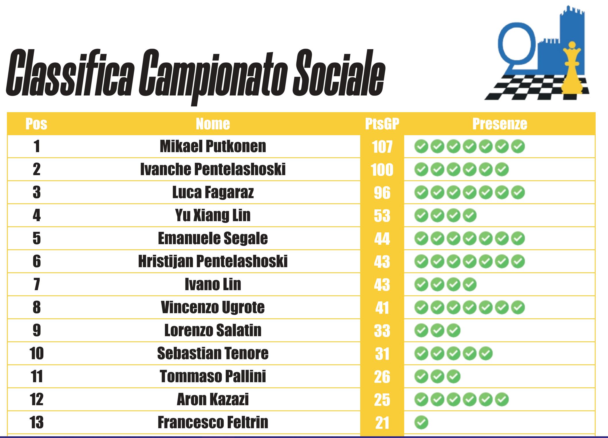
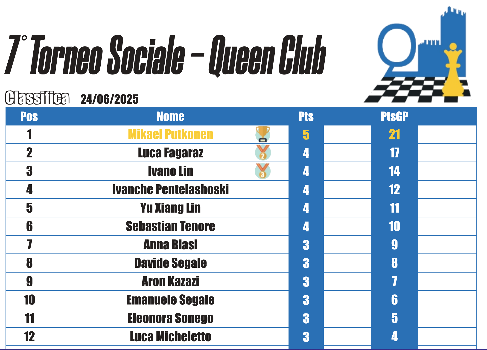

# Chess Ranking Utility

## Automation software

The repo includes a command line utility (built with python) to automate the assignments of points of a series of chess tournaments and automatically update the general ranking (with a set of rules for which each player gets a number of points per tournament based on the standings result of each tournament itself).

```
❅ ===================================== ❅
❅ = ♚ Chess ranking update software ♛ = ❅
❅ ===================================== ❅
```

The repo also includes a webapp (built with React and NodeJS) that allows to automatically generate visual standings tables with the data generated by the utility and export them as PDF files.

<p align="center">
  
  
</p>

> [!NOTE]
> All the data is handled using YAML files